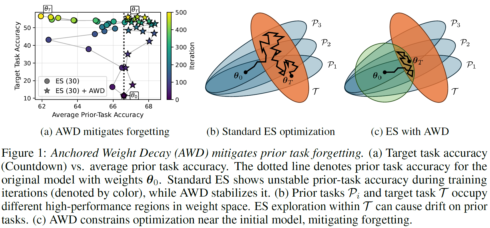
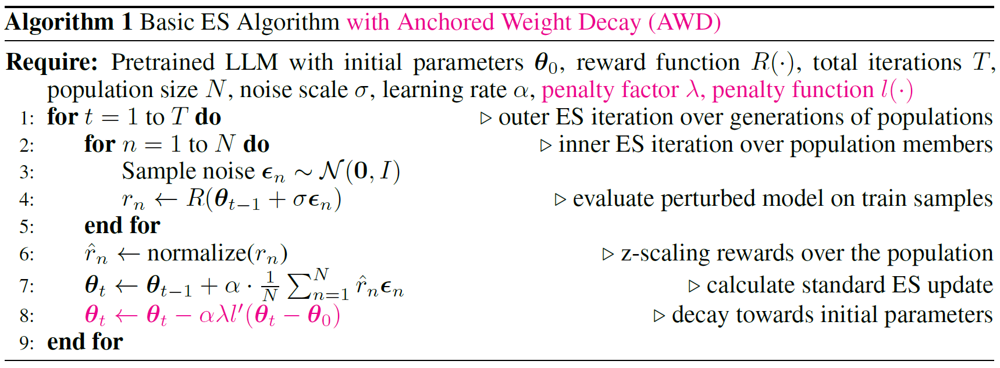

# Overcoming Forgetting in LLM Fine-Tuning with Evolution Strategies

This repository contains the code for the paper [**"Overcoming Forgetting in LLM Fine-Tuning with Evolution Strategies"**](https://arxiv.org/abs/2605.30148). It studies prior-task forgetting under Evolution Strategies (ES) fine-tuning of LLMs, and introduces **Anchored Weight Decay (AWD)** — a simple, computationally cheap regularization that constrains weight updates toward the initial model to prevent forgetting.

Key findings:
- Prior-task forgetting under ES fine-tuning is better characterized as *performance drift* rather than irreversible forgetting, and often recovers during training.
- Forgetting is not specific to ES, also RL methods (GRPO) may induce forgetting.
- The primary driver of forgetting in ES is a random walk in directions of weight space weakly constrained by the target task - which can be mitigated by large population sizes as well as AWD.
- AWD effectively stabilizes prior-task performance while preserving target-task performance, achieving benefits comparable to large ES population sizes at much lower computational cost.

<p align="center">
  
</p>

---

## Project Structure

```
es_finetuning/
├── es.py                        # Main ES training script
├── distributed_utils.py         # Ray/vLLM engine management
├── weight_update_utils.py       # Weight perturbation and AWD update logic
├── run.sh                       # Example ES launch script
│
├── grpo_experiments/            # GRPO baseline runs (via verl)
│   ├── grpo_<model>_<task>_s<seed>.sh # One launch script per experiment
│   ├── merge_fsdp_to_hf.sh     # Convert FSDP checkpoints to HF format
│   └── delete_optim_checkpoints.sh # reduce disc usage during verl runs
│
├── tasks/                       # Training tasks (target tasks)
│   ├── countdown/               # Arithmetic construction task
│   ├── gsm8k/                   # Grade-school math word problems
│   └── proofwriter/             # Logical reasoning
│
├── prior_tasks/                 # Evaluation-only benchmarks (prior tasks)
│   ├── hellaswag/               # Commonsense completion
│   ├── piqa/                    # Physical commonsense reasoning
│   ├── arc_challenge/           # Science multiple-choice
│   └── mmlu_pro/                # Broad academic knowledge
│
├── evaluation/                  # Evaluation scripts and analysis notebooks
│   ├── evaluate_forgetting.py   # Measure per-task accuracy over training
│   ├── evaluate_kl_divergence.py # Measure KL-divergence
│   ├── evaluate_weight_change.py # Measure norm of weight updates
│   ├── run_forgetting.sh        # Batch forgetting evaluation launcher
│   ├── run_kl_divergence.sh     # Batch kl-divergence evaluation launcher
│   ├── run_weight_changes.sh    # Batch update norm evaluation launcher
│   └── *.ipynb                  # Notebooks to create paper figures and tables
│
└── assets/                      # Assets used in this README
```

---

## Setup

### Requirements

All experiments were run on a node with eight H200 GPUs. A CUDA-capable GPU is required for both training and evaluation.

Install the dependencies:

```bash
pip install -r requirements.txt
```

> **Note:** The `requirements.txt` captures the full environment used for the paper. In practice the key packages are `torch`, `vllm`, `ray`, `transformers`, `wandb`, and `datasets`. For GRPO runs, [verl](https://github.com/verl-project/verl) must be installed separately following their documentation.

### Models

The default model is **Qwen2.5-3B-Instruct**, downloaded automatically from HuggingFace on first use. Experiments also cover Qwen2.5-{1.5B,3B,7B}-Instruct and Llama-3.2-3B-Instruct. All models require accepting the respective license agreements on HuggingFace.

---

## Running ES Experiments

### Basic run (Countdown, Qwen2.5-3B-Instruct, pop size 30, no AWD)

```bash
python es.py \
    --model_name Qwen/Qwen2.5-3B-Instruct \
    --task countdown \
    --num_engines 8 \
    --cuda_devices 0,1,2,3,4,5,6,7 \
    --population_size 30 \
    --precision float16 \
    --global_seed 42 \
    --num_iterations 500 \
    --experiment_dir experiments/es \
    --caching \
    --wandb_project es-forgetting
```

### With Anchored Weight Decay (AWD)

Add `--weight_decay_type` and `--weight_decay_lambda` to enable AWD:

```bash
# L2 penalty (lambda = 10.0, recommended)
python es.py \
    --model_name Qwen/Qwen2.5-3B-Instruct \
    --task countdown \
    --num_engines 8 \
    --cuda_devices 0,1,2,3,4,5,6,7 \
    --population_size 30 \
    --precision float16 \
    --global_seed 42 \
    --num_iterations 500 \
    --experiment_dir experiments/es \
    --caching \
    --wandb_project es-forgetting \
    --weight_decay_type l2 \
    --weight_decay_lambda 10.0

# L1 penalty (lambda = 0.01)
python es.py ... --weight_decay_type l1 --weight_decay_lambda 0.01
```

AWD implements the following change to the update rule of ES:

<p align="center">  </p>

### Key arguments

| Argument | Default | Description |
|---|---|---|
| `--model_name` | `Qwen/Qwen2.5-3B-Instruct` | HuggingFace model identifier |
| `--task` | `countdown` | Training task: `countdown`, `gsm8k`, `proofwriter` |
| `--population_size` | `30` | ES population size (paper uses 30, 128, 256) |
| `--num_engines` | `4` | Number of parallel vLLM engines (= number of GPUs) |
| `--sigma` | `0.001` | Perturbation noise scale |
| `--alpha` | `0.0005` | Learning rate (defaults to `sigma/2`) |
| `--num_iterations` | `500` | Total training iterations |
| `--weight_decay_type` | `none` | AWD penalty: `none`, `l1`, `l2` |
| `--weight_decay_lambda` | `0.0` | AWD regularization strength |
| `--caching` | off | Cache noise tensors to reduce re-generation overhead (trades memory for compute) |
| `--eval_interval` | `25` | Evaluate on target task every N iterations |

Outputs are saved to `<experiment_dir>/<run_name>/`, including `args.json`, per-iteration update files under `iteration_updates/`, and `final_model_weights.pt`.

---

## Running GRPO Experiments

GRPO baseline runs require [verl](https://github.com/volcengine/verl). Install it and its dependencies following their documentation, then launch a pre-configured experiment:

```bash
# from the repo root
bash grpo_experiments/grpo_qwen_3b_countdown_s42.sh
```

Scripts follow the naming convention `grpo_<model>_<task>_s<seed>.sh`. 

Checkpoints land under `grpo_experiments/checkpoints/`. Convert them to HuggingFace format for evaluation:

```bash
bash grpo_experiments/merge_fsdp_to_hf.sh \
    grpo_experiments/checkpoints/<experiment-dir>

# Then create model.txt in the merged directory
echo "Qwen/Qwen2.5-3B-Instruct" \
    > grpo_experiments/merged/<experiment>_global_step500/model.txt
```

---

## Evaluation

After training, evaluation proceeds in three steps. All scripts auto-detect whether a run directory is an ES or GRPO run.

### 1. Measure per-task accuracy over training

```bash
# Single run, all tasks
RUN_DIR=experiments/es/<run_name> DEVICE_ID=0 bash evaluation/run_forgetting.sh

# Or directly for a specific task
python evaluation/evaluate_forgetting.py \
    --run_dir experiments/es/<run_name> \
    --dataset hellaswag \
    --cuda_devices 0
```

Supported datasets: `countdown`, `gsm8k`, `proofwriter`, `hellaswag`, `piqa`, `arc-challenge`, `mmlu-pro`.

Results are written to `<run_dir>/<dataset>.jsonl`.

### 2. Measure distributional shift (KL divergence)

```bash
bash evaluation/run_kl_divergence.sh experiments/es/<run_name> 0
```

Results are written to `<run_dir>/<dataset>_kl.jsonl`.

### 3. Measure weight drift

```bash
bash evaluation/run_weight_changes.sh experiments/es/<run_name> 0
```

Results are written to `<run_dir>/weight_change.jsonl`.

### 4. Reproduce paper figures

Execute the notebooks in `evaluation/`, selecting the respective runfiles:

| Notebook | Figure |
|---|---|
| `plot_main_figure.ipynb` | Fig. 1 — AWD vs. standard ES scatter plot |
| `plot_forgetting_three_tasks.ipynb` | Fig. 2, 3 — accuracy curves across three target tasks |
| `plot_influence.ipynb` | Fig. 4 — forgetting across model types |
| `plot_lambda_ablation.ipynb` | Fig. 5 — λ ablation for AWD |
| `plot_weight_frobenius.ipynb` | Fig. 6 — weight update norms |
| `plot_kl_heatmap.ipynb` | Fig. 7 — KL divergence heatmap |
| `create_latex_table.ipynb` | Tables |

---

## Compute

All experiments were run on a single node with **eight H200 GPUs**. Approximate runtimes (Countdown, 500 iterations):

| Setup | Node-hours |
|---|---|
| ES, 1.5B model | ~3 |
| ES, 3B model | ~4 |
| ES, 7B model | ~6 |
| GRPO, 1.5B model | ~14 |
| GRPO, 3B model | ~20 |
| GRPO, 7B model | ~32 |

Total required compute for reproducing all results of the paper: ~52 node-days.

---

## Citation

```bibtex
@article{schweighofer2026overcoming,
  title   = {Overcoming Forgetting in LLM Fine-Tuning with Evolution Strategies},
  author  = {Kajetan Schweighofer and Conor F. Hayes and Roberto Dailey and Risto Miikkulainen and Xin Qiu},
  journal = {arXiv preprint arXiv:2605.30148},
  year    = {2026}
}
```
